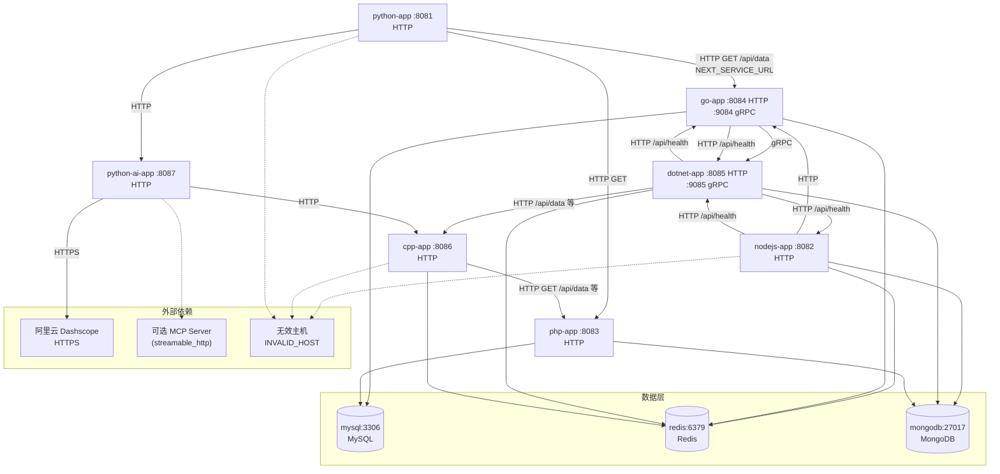

# obi-demo

多语言演示微服务：**Python、Node.js、Go、gRPC（.NET / Go）、C++、PHP、FastAPI（AI）**，配合 **MySQL、Redis、MongoDB**。用于端到端链路、观测与故障场景演练（超时、下游错误、gRPC、数据库慢查询等）。

## 快速开始

需要已安装 [Docker](https://docs.docker.com/get-docker/) 与 Docker Compose。

```bash
docker compose up --build
```

首次启动会拉取基础镜像并构建各应用镜像；MySQL / MongoDB 健康检查通过后再启动依赖它们的应用。

### 本机端口（默认映射）

| 服务 (Compose) | 说明 | 端口 |
|----------------|------|------|
| **python-app** | Flask HTTP | **8081** |
| **nodejs-app** | Express HTTP | **8082** |
| **php-app** | PHP HTTP | **8083** |
| **go-app** | Go HTTP / gRPC | **8084** / **9084** |
| **dotnet-app** | .NET HTTP / gRPC | **8085** / **9085** |
| **cpp-app** | C++ HTTP | **8086** |
| **python-ai-app** | FastAPI（大模型/MCP 等） | **8087** |
| **mysql** | 数据库 | 3306 |
| **redis** | 缓存 | 6379 |
| **mongodb** | 文档库 | 27017 |

入口探活示例：

- `http://localhost:8081/api/health`（Python）
- `http://localhost:8082/api/health`（Node.js）
- `http://localhost:8084/api/health`（Go HTTP）

## 架构与调用关系

### 服务与协议

- **应用间：** 主要为 **HTTP（JSON）**；**go-app ↔ dotnet-app** 之间在同一套 **`DemoService`** 上充当 **客户端 / 服务端**（见下文）。
- **数据层：** **MySQL**（各语言驱动）、**Redis**（各客户端）、**MongoDB**（驱动直连）。

### go-app 与 dotnet-app 的 gRPC 关系

二者共用 `infra/proto/demo.proto` 中的 **`DemoService`**（RPC：`GetData`、`GetDataError`）。

| 角色 | 服务 | 监听 | 说明 |
|------|------|------|------|
| **gRPC Server** | **dotnet-app** | `:9085`（HTTP/2） | 实现 `DemoService`，供 Go（及其他 gRPC 客户端）调用 |
| **gRPC Client** | **go-app** | 出站连接 `DOTNET_GRPC_ADDR`（默认指向 dotnet 的 **9085**） | `main.go` 中 `grpcClient.GetData` / `GetDataError` |

**go-app** 同时又在 `:9084` 上暴露 **同名** `DemoService`（供历史或其它客户端按需使用）；与 **dotnet** 的那段关系是：**Go 调 .NET**，不是反向。

默认编排下，`python-app` 的 **`NEXT_SERVICE_URL` 指向 go-app**。因此存在一条清晰的 **HTTP → gRPC** 链：

**python-app** —`GET /api/data` (HTTP)—→ **go-app** —`GetData` (gRPC)—→ **dotnet-app**。

### 调用关系图（服务名、协议、关键接口）



### 典型主链路：`/api/data`

按「自上而下」的合成观测链可以理解为：

1. **python-app** `GET /api/data`：读 MySQL；按 `NEXT_SERVICE_URL` **HTTP** 调用 **go-app** `GET /api/data`；另调 **php**、**python-ai** `/health`。默认 `NEXT_SERVICE_URL=http://go-app:8084`。
2. **go-app** `GET /api/data`：MySQL + Redis；**gRPC `GetData`** 调 **dotnet-app**；旁路 **dotnet** `GET /api/health`。
3. **nodejs-app** `GET /api/data`（若从其它入口或直接访问）：Redis + MongoDB；HTTP 调 **go** `GET /api/data`；旁路 `/api/health` 等——与 Python 默认链并行存在，不参与 Python 的第一步。
4. **dotnet** 在 **gRPC `GetData`** 内：MongoDB + Redis；HTTP 调 **cpp** `GET /api/data`；旁路 **go / nodejs** 的 `/api/health`。
5. **cpp-app** `GET /api/data`：Redis；**HTTP** 调 **php** `GET /api/data`。
6. **php-app** `GET /api/data`：仅 **MySQL + MongoDB**，不调用其他应用服务。

**python-ai-app** 还提供 `GET /api/data`（演示路径），内部会请求 **cpp** 的 `/api/data`，与上面主链可同时存在多条入口。

各服务另有 `/api/slow`、`/api/error`、`/api/*-downstream` 等场景接口，便于压测与观测验证。

## 配置说明

- 服务间地址与密码等以 **`docker-compose.yml` 中的 `environment`** 为准。**Python 下游 HTTP** 由 `NEXT_SERVICE_URL` 控制（默认可指向 **go-app** 以实现 Python→HTTP→Go→gRPC→.NET）；**Go 调 .NET** 使用 `DOTNET_GRPC_ADDR`（gRPC **9085**）与 `DOTNET_HTTP_ADDR`（旁路 HTTP 健康检查等）。
- **python-ai-app** 使用阿里云兼容 OpenAI 的 HTTPS 端点；若需真实对话/向量等能力，请配置 `OPENAI_API_KEY`（或相关 DashScope 变量），详见 `python-ai-service/app.py`。
- 可选 **MCP**：设置 `MCP_SERVER_URL` 后，AI 服务可连接外部 MCP（`streamable_http`）。

## 仓库结构（简要）

| 路径 | 内容 |
|------|------|
| `docker-compose.yml` | 编排所有服务与网络 |
| `infra/sql/`、`infra/mongo/` | 数据库初始化脚本 |
| `infra/proto/demo.proto` | gRPC `DemoService` 定义 |
| `*-service/` | 各语言应用源码与镜像构建 |

## 许可证

若仓库根目录未包含 `LICENSE` 文件，默认以项目维护者后续补充为准。
